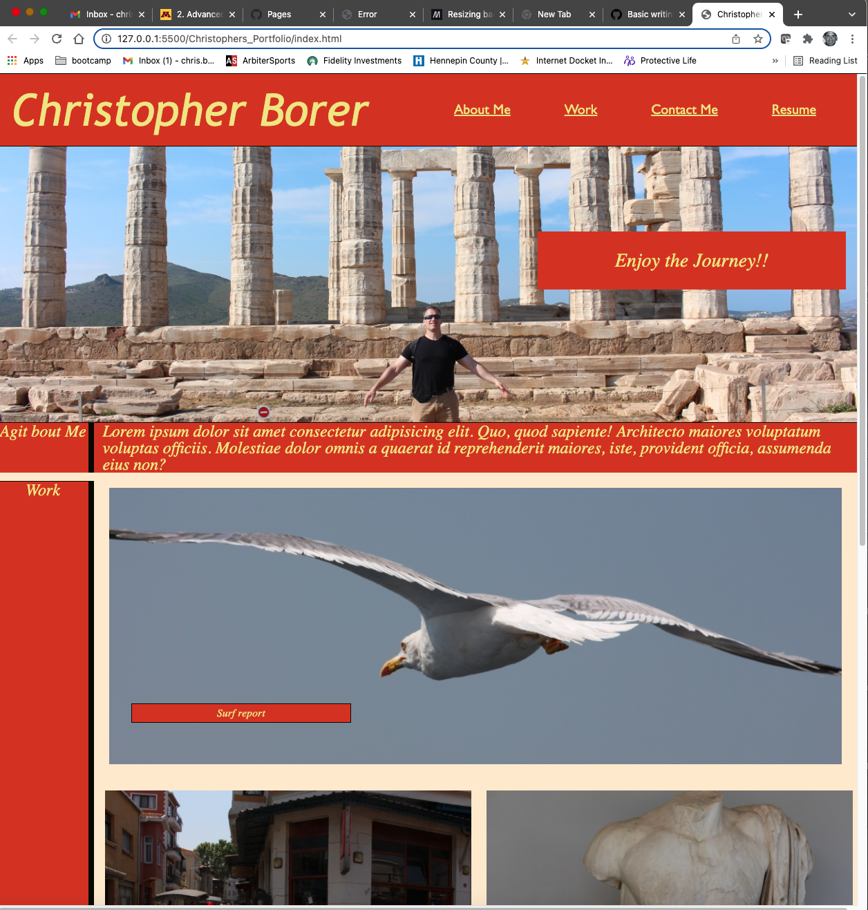

<<<<<<< HEAD
# React + Vite

This template provides a minimal setup to get React working in Vite with HMR and some ESLint rules.

Currently, two official plugins are available:

- [@vitejs/plugin-react](https://github.com/vitejs/vite-plugin-react/blob/main/packages/plugin-react) uses [Babel](https://babeljs.io/) for Fast Refresh
- [@vitejs/plugin-react-swc](https://github.com/vitejs/vite-plugin-react/blob/main/packages/plugin-react-swc) uses [SWC](https://swc.rs/) for Fast Refresh

## Expanding the ESLint configuration.

If you are developing a production application, we recommend using TypeScript with type-aware lint rules enabled. Check out the [TS template](https://github.com/vitejs/vite/tree/main/packages/create-vite/template-react-ts) for information on how to integrate TypeScript and [`typescript-eslint`](https://typescript-eslint.io) in your project.
=======
# Christophers_Portfolio

A portfolio of Christopher Borer's web design projects.
This is a web site designed to show a potential employer my accomplishemtns as a programmer and provide some insight into my personality and personal life.

Criteria:
1. Provides a sample of my previous work
2. The design has my name, a subtitle, and the navigation links at the top.
3. Each navigation links take you to one of three sectiions:
   A summary about me, links to my past work, and how to contact me.
4. The about me section has a paragraph explaining my professional goals
5. The work section has images and with captions that are linked to my past work.
6. the contact me secion has my phone number, a like to my github page, a link to 
   my linkdin 
7. The first application's image should be larger in size than the others
8. each image is a link to a deployed application.
9. The site is responsive to fit nicely on any size divice.

github link to the final version of code.
This site was built using [GitHub Pages](https://github.com/cspower5/Christophers_Portfolio).

>>>>>>> ac1819b634d60cad60e032aef097f8f0a13fb1dc
